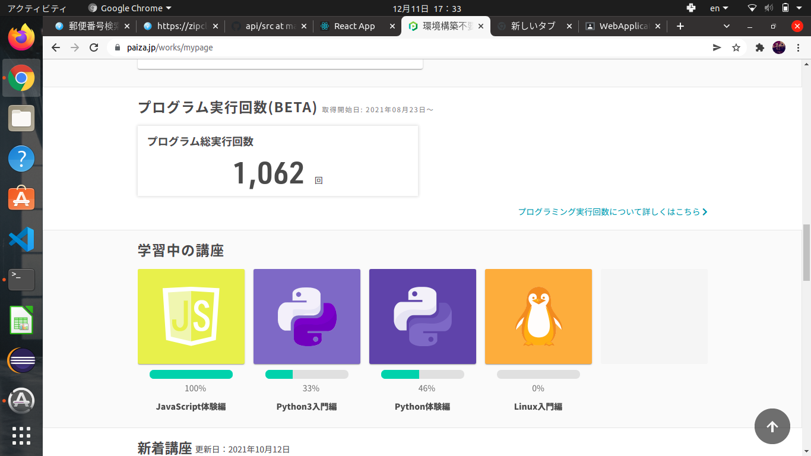

# WebApplication課題

## paizaのスクリーンショット  

# APIソースコード
* 郵便番号検索アプリ

## ソースコード
* [メインコード(App.js)](./src/component/App.js)
* [ヘッダーコード(Header.js)](./src/component/Header.js)
* [検索コード(Search.js)](./src/component/Search.js)
* [cssコード(App.css)](./src/App.css)

### 使用方法
* 郵便番号を検索BOXに入力すると結果が出てくる
